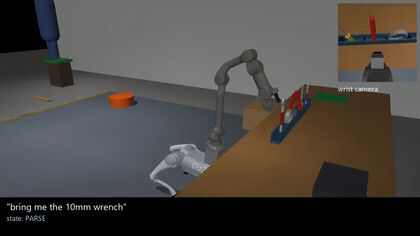
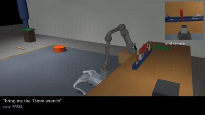
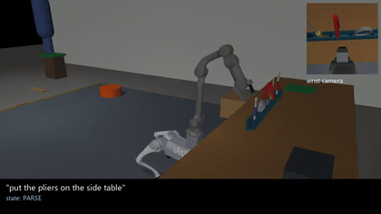

# Bring me the 10mm wrench

Language-commanded mobile manipulation in simulation, trained and evaluated end to end on **one
6 GB consumer GPU (RTX 3060 laptop) — no API keys, no cloud, no cluster**.

You type *"bring me the 10mm wrench"*. A Unitree Go2 with a Z1 arm, in MuJoCo, walks to the
workbench, finds the wrench with a vision-language model, picks it out of the rack, carries it
across a 12 cm step and hands it to a person — and says something useful when it cannot.



*One command, start to finish. Main view is the tracking camera, inset is the wrist camera — what
the grounding model and the learned policy actually see. The caption is the orchestrator's live
state.*

**[▶ Full 2:26 montage](media/montage.mp4)** — all five tools carried, all five recovery modes.

---

## What this is, in one diagram

```
"bring me the 10mm wrench"
        |
        v
  orchestrator (state machine, bw/orchestrator.py)
        |            gates: base at station? point returned? gripper holding? gripper empty?
        +--> navigate_to   Layer 3: RL walking policy (numpy, 50 Hz)       bw/locomotion/
        +--> locate        Layer 1: Qwen3-VL-2B point -> wrist depth -> 3D bw/perception/
        +--> grasp/place   Layer 2: SmolVLA, or the scripted demonstrator  bw/manip/, bw/policy/
        +--> ask_human     when the command is ambiguous or the tool is gone
```

Four layers, one contract each. The orchestrator advances on **observable gates** — is the base at
the station, did `locate()` return a point, is the gripper holding something — never on "the
script probably worked".

---

## Results

Every number is produced by a script in this repo, on fixed seeds, with failures counted and
tagged by cause.

| what | number | how |
|---|---|---|
| Grasp, on legs, 5 tools | **125/125** | `scripts/try_grasp.py 25 --walk` |
| Two-table transfer, walking between stations | **120/125** (A), **124/125** (B) | `scripts/try_place.py 25 --walk --table X` |
| Grounding `locate()` | **10.7 mm** median xy error, **2.8%** miss | `scripts/bench_locate.py` |
| Demonstration data | **1,128 episodes** / 104k frames, LeRobot v3.0 | `scripts/collect_demos.py` |
| **End to end, 7 suites x 10 seeds** | **60/70 (86%)** | `ops/run_eval_suites.sh` |
| **Learned policy (SmolVLA), held-out scenes** | **grasp 18/20, correct object 20/20** | `ops/run_eval_vla.bat` |
| Layer 3 numpy controller vs MJX | action difference 1.8e-6 | `scripts/t5_obs_check.py` |

### End to end, per suite

| suite | success | what lost the rest |
|---|---|---|
| nominal ("bring me the ...") | 8/10 | 2 falls stepping down off the walkway |
| two-table transfer | 9/10 | 1 tool placed outside the zone |
| missing tool -> report it | 10/10 | — |
| mid-carry drop -> re-grasp | 9/10 | 1 fall on the step |
| ambiguous "wrench" -> ask | 8/10 | 2 falls on the step |
| retarget mid-walk | 6/10 | 3 falls on the step, 1 grasp |
| obstacle on the route -> detour | 10/10 | — |

**The dominant failure is locomotion, not manipulation.** 8 of the 10 failures are the base
falling on the 12 cm step DOWN while carrying a tool. No trial is lost to the grasp, the place or
the grounding layer's own skill.

That claim was carried for five sessions on the strength of a cause label — until the label turned
out to mean two different things. `nav_dest_failed` is written both when the robot falls and when
it walks stably but never arrives. The trial row now records `loco.is_stable()` and the per-leg
`fell` flag, and the answer came back unambiguous: `fell=True`, `stable=False`, 749 mm short, tool
still in the jaws. The claim was right — but it wasn't *known* until it was instrumented.

---

## Recovery: what happens when it goes wrong

Five failure modes, each a scored suite rather than a demo.

| | |
|---|---|
|  | **Dropped mid-carry — 9/10.** The tool falls out of the jaws on the walk. The robot notices the gripper is empty, asks for it back, and resumes. |
|  | **Blocked route — 10/10.** A box lands on the path after the tool is in the jaws. It estimates the stall direction, plans a detour and places anyway. Was 0/2 before three separate defects were found. |

Also measured: **ambiguous name** ("bring me the wrench" -> *"which one: 10mm or 13mm?"*) 8/10,
**missing tool** (says so instead of guessing) 10/10, and **retarget** (the human changes their
mind mid-task) 6/10.

---

## The learned policy: a negative result that was diagnosed until it turned positive

The most useful part of this project is not the 18/20. It is the chain that got there.

SmolVLA, fine-tuned on the 1,128 demonstrations, scored **1/20** and then **0/20**. Rather than
throw GPU hours at it, each hypothesis was eliminated by measurement:

| hypothesis | how it was tested | verdict |
|---|---|---|
| Not enough capacity / broken pipeline | overfit control: 40 episodes seen 11.7x | **ruled out** — 3.8x better than baseline |
| Wrong action representation | `--delta` records `q_cmd - q_state` | real, but not sufficient |
| Covariate shift / generalisation | evaluated on *training* scenes | **ruled out** — still 0/20 |
| Image domain gap | PSNR 39 dB train vs eval | ruled out |
| Chunk horizon | swept `n_action_steps` | ruled out — 10 is correct |
| **Action scale** | measured per-joint motion against the normaliser | **this was it** |

The root cause had two independent parts: the transport swing accounted for **91% of joint 1's
squared motion**, drowning the 3–5 mrad approach motion that actually decides the grasp; and pick
and place shared one normaliser while place carries **2.4 rad IK jumps** in a single 10 Hz tick.

Three corrections, each with a measurement behind it — train on the **fine phase** only, **pick
only**, and **quantile** normalisation instead of mean/std:

```
                      before      after
grasp, held out        0/20       18/20
correct object          —         20/20
j1 error           0.0289 rad   0.0067 rad      (~15 mm -> ~3.5 mm at the gripper)
gripper channel    0.0095       0.0011          (9x better than "do nothing")
```

**What it does not do**, stated plainly: transport is still scripted — the policy is handed the
pre-grasp pose and does approach, close and lift. Place is 0/20 *by construction* (excluded from
training). And the second grasp after a tool swap is 0/20 while the first is 18/20, in the same
trials, which is **unexplained**.

---

## Locomotion: the result that is a clean negative

The step-down is the system's bottleneck, and it *is* solvable — in a policy that can't be used.

| policy | gate 2 @ 0.12 m | can turn / back / sidestep | end to end |
|---|---|---|---|
| original (`stairs_run7`) | 19 falls / 20 | yes | 60/70 |
| `payload_l5b` (forward-only curriculum) | **0 falls / 20** | **no** | cannot ship |
| `payload_nav_l5b` (curriculum + full command set) | 12 falls / 20 | yes, within 8% | **28/70 — reverted** |

Training the same step curriculum under the full command distribution bought the **best
disturbance rejection in the project** (320 N push recovery, arm extended, against the original's
200 N) and did *not* buy the step. Those are separable capabilities.

It was swapped in anyway, on the reasoning that the gate tests the arm extended while the pipeline
stows it. End-to-end collapsed 60/70 -> 28/70 — every human-destination suite at 0/10, every
table-destination suite at 9–10/10 — and it was reverted by hash. **The gate said FAIL and the
gate was right.** A plausible story about why a gate might not transfer is not evidence.

The step-height sweep is the publishable form of this:

| step height | 0.06 | 0.08 | 0.10 | 0.11 | 0.12 | 0.13 |
|---|---|---|---|---|---|---|
| original, falls/20 | 0 | 3 | 14 | 18 | **19** | 20 |
| `payload_l5b`, falls/20 | 0 | 0 | 0 | 0 | **0** | 5 |
| `payload_nav_l5b`, falls/20 | 0 | 0 | 1 | 8 | **12** | 12 |

---

## Quickstart

```bash
pip install -e .              # makes `bw` importable; deps are NOT declared on purpose

# three environments, because they cannot be one (docs/ARCHITECTURE.md explains why):
#   requirements/render-windows.txt   CPU sim + ALL rendering (EGL fails inside WSL)
#   requirements/mjx-wsl.txt          MJX/brax locomotion training + the Phase 1 gate
#   requirements/vla-wsl.txt          SmolVLA fine-tune + policy server

bash download_models.sh                             # the trained policies
python -m bw.sim.build_models                       # regenerate the four model XMLs

python scripts/try_grasp.py 25 --walk               # grasp benchmark: expect 125/125
python scripts/eval_suite.py --suite nominal --n 10 # one end-to-end scenario
python scripts/make_orch_video.py 3 out.mp4 --suite nominal    # render a run
```

New here? Read **[`HANDOFF.md`](HANDOFF.md)** — the full account of what was built, what failed
and why, and what to do next. Then **`docs/ARCHITECTURE.md`** (four layers, one contract each) and
**`STATUS.md`** for the live numbers and the traps.

---

## What is honest about this

- **Simulation only.** Nothing here has run on hardware, and no claim is made that it would.
- The demonstrator uses ground-truth object poses **on purpose** — it is the teacher. The policy
  trained on it sees only two 256x256 RGB cameras, the 7-D arm state and the instruction.
- The 10 mm vs 13 mm distinction is carried by a **coloured grip band plus a size->colour lookup**,
  because the VLM is at **chance** on the size itself (92.9% on the band). Measured, not hidden.
- Grounding on a real VLM has a **trade-off, not a fix**: adding an absent-tool check took the
  missing-tool scenario to 9/10, and dropped nominal from 10/10 to **3/10** — a ~70% false-positive
  rate on absent tools became a ~70% false-negative rate on present ones.
- `wrench_13mm` is the only tool with no nominal success, reproduced independently twice.
- On this machine, **`exit 0` means nothing**: five separate things reported success while doing
  nothing or the wrong thing. `STATUS.md` names all five.

---

## Layout

```
bw/sim/             the workshop scene and the MuJoCo wrapper (WorkshopSim)
bw/locomotion/      Layer 3: MJX/brax training, the numpy controller, the navigator
bw/manip/           scripted grasp / place / handoff demonstrator + IK
bw/perception/      Layer 1: vlm.point() (model in its own process) and locate()
bw/policy/          SmolVLA inference server + the skill client
bw/task/            the one success spec, and the instruction paraphrases
bw/orchestrator.py  the state machine
scripts/            benchmarks, collectors, evaluation suites, video renderers
ops/                run scripts (training, collection, conversion) + the job queue runner
docs/               ARCHITECTURE.md, blog.md (the story of the bugs), STATUS_archive.md
```

## Credits

Built on MuJoCo/MJX, brax, LeRobot (SmolVLA), Qwen3-VL, and Unitree's Go2 + Z1 models.
